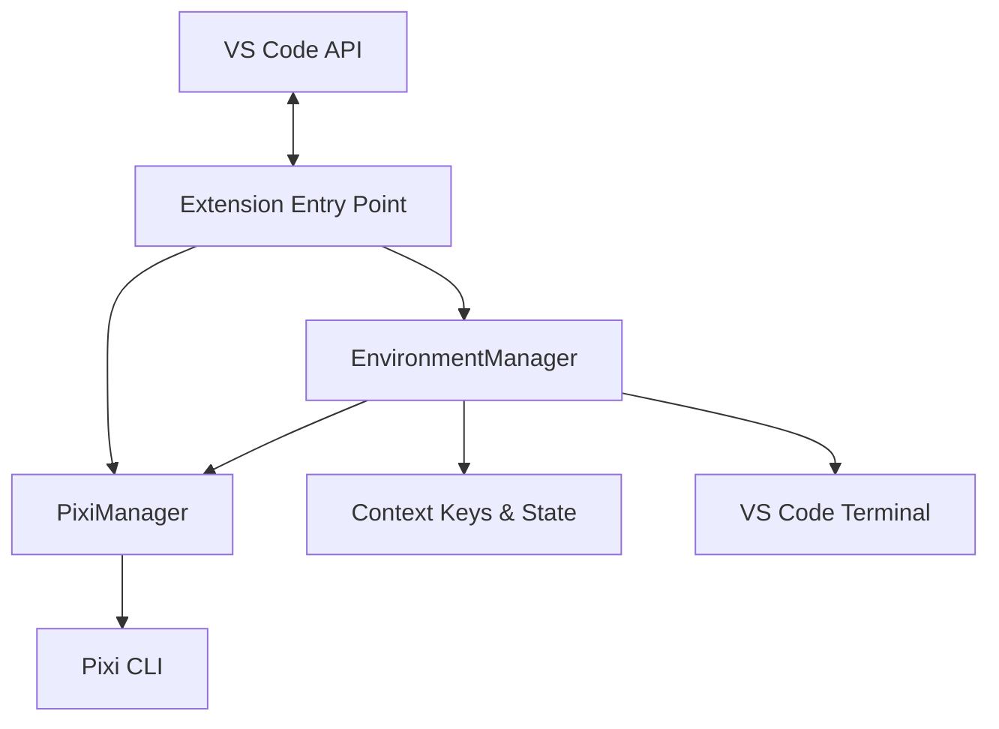

# Architecture & Code Structure

This document provides a deep dive into the internal architecture of the Pixi VS Code Extension. It is intended for new contributors who want to understand how the code works under the hood.

## High-Level Overview

The extension acts as a bridge between VS Code's environment (terminal, variables, context) and the [Pixi](https://pixi.sh/) CLI. It does not re-implement Pixi logic; instead, it orchestrates Pixi commands and parses their output to update the editor state.

## Core Components

### 1. `src/extension.ts` (Entry Point)
- **Responsibility**: Registers commands, sets up the extension context, and initializes the core managers.
- **Key Actions**:
  - Registers commands like `pixi.activate`, `pixi.createEnvironment`.
  - Instantiates `PixiManager` and `EnvironmentManager`.
  - Triggers `autoActivate()` on startup to restore the last used environment.

### 2. `src/pixi.ts` (Pixi Wrapper)
- **Responsibility**: Abstracts the interaction with the Pixi executable and the filesystem.
- **Key Methods**:
  - `isPixiInstalled()`: Checks if the `pixi` binary is available.
  - `getPixiPath()`: Resolves the path to the Pixi executable (local or global).
  - `initProject()`: Runs `pixi init`.
  - `installPixi()`: Downloads and installs Pixi if missing.

### 3. `src/environment.ts` (Business Logic)
This is the heart of the extension. It manages the lifecycle of Pixi environments.

- **Responsibility**:
  - Activation/Deactivation of environments.
  - Parsing `pixi shell-hook` output to extract environment variables.
  - Injecting variables into VS Code via `environmentVariableCollection`.
  - Managing Offline environments.
  - Updating Context Keys (`pixi.hasPixiDirectory`, `pixi.isEnvironmentActive`).

## Key Workflows

### Environment Activation
The activation process (`activate()`) ensures that the VS Code terminal and extensions run with the correct dependencies.

1.  **Detection**: Checks `pixi.toml` and available environments.
2.  **Selection**: If multiple environments exist, prompts the user to select one (default: `default`).
3.  **Shell Hook**: Executes `pixi shell-hook` to get the raw environment variables (JSON format).
4.  **Injection**:
    - Clears previous environment variables.
    - Iterates through the JSON output.
    - Uses `context.environmentVariableCollection.replace()` to inject them into VS Code's session.
5.  **State Update**: Sets `pixi.isEnvironmentActive` to `true`.

### Offline Environment Support
For air-gapped or restricted machines, the extension supports "Offline Environments".

#### Generation (`generateOfflineEnvironment`)
1.  **Analysis**: Reads `pixi.toml` to identify target platforms (linux-64, osx-arm64, win-64, etc.).
2.  **Packing**: Runs `pixi-pack` (installed via `pixi global install pixi-pack`) to create a compressed environment tarball.
3.  **Scripting**: Generates a platform-agnostic installer script (`install.sh`, `install.bat`) that unpacks the environment and sets up paths.

#### Loading (`loadOfflineEnvironment`)
1.  **User Input**: User selects an installer script via file picker.
2.  **Unpacking**: The extension runs the script to unpack the environment into `.pixi/envs/<offline_name>`.
3.  **Activation**: The extension parses the `activate` script within the unpacked environment to extract variables and injects them into VS Code.

## Context Keys
The extension uses VS Code [Context Keys](https://code.visualstudio.com/api/references/when-clause-contexts) to control command visibility.

| Key | Description |
| :--- | :--- |
| `pixi.hasPixiDirectory` | True if `.pixi/` folder exists in root. |
| `pixi.hasProjectManifest` | True if `pixi.toml` exists. |
| `pixi.isPixiInstalled` | True if `pixi` executable is found. |
| `pixi.isEnvironmentActive` | True if a Pixi environment is currently active. |

## Source Tree
- `src/`
  - `extension.ts`: Main entry point.
  - `pixi.ts`: Low-level Pixi CLI interactions.
  - `environment.ts`: High-level logic.
  - `test/`: Integration tests.
